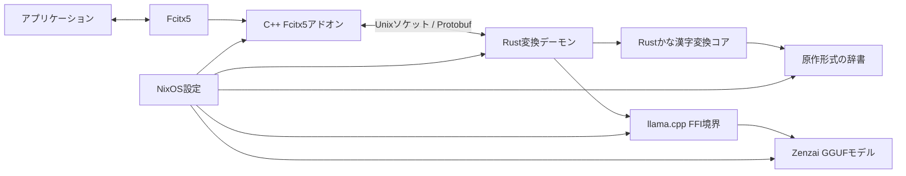
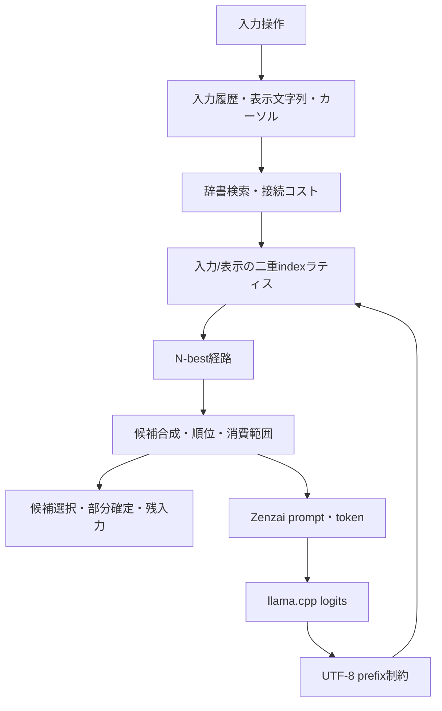
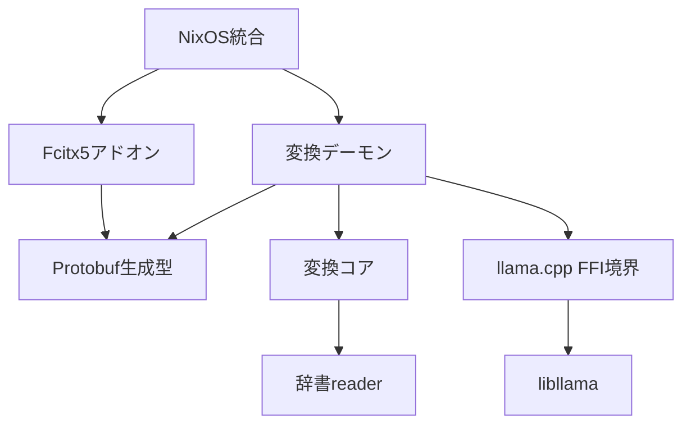

# NixOS向けZenzai対応かな漢字変換システム アーキテクチャ

- 文書状態: Draft
- 作成日: 2026-08-14
- 対象仕様: [spec.md](./spec.md)
- 原作調査: [research.md](./research.md)
- 原作スナップショット: [`93766c46e31fa6a18b7ced49dab31337780f6f45`](https://github.com/azooKey/AzooKeyKanaKanjiConverter/commit/93766c46e31fa6a18b7ced49dab31337780f6f45)

## この文書の責任

この文書は、`spec.md`の要件をどの構成で実現するかを定義する。採用する言語、コンポーネントの責任、依存方向、原作互換境界、プロセス境界、データ、NixOSへの組み込み方を扱う。

実装対象に含める機能、現在の正常動作検証、将来の原作適合検証および完了条件は`spec.md`の責任とする。原作から確認した事実と根拠は`research.md`に置き、この文書では実装に必要な設計上の帰結だけを扱う。

## 設計の中心

本プロジェクトの主成果は、固定したAzooKeyKanaKanjiConverterで確認できるかな漢字変換機能をSwiftなしで再実装するエンジンである。機能は依存関係に沿って1個ずつ追加し、最終的にはすべてを実装する。

Fcitx5連携、変換デーモン、llama.cpp連携、NixパッケージとNixOS統合は、そのエンジンをNixOS上で利用するための境界として置く。azooKey Desktopのアプリケーション構造を再現することは目的にしない。

変換エンジンについて、原作以外のLinux向け移植は、アーキテクチャ、実装、プロトコル、テストのいずれでも意図的に参照しない。Fcitx5との接続部分だけは、[fcitx5-mozcの固定実装](https://github.com/fcitx/mozc/tree/3f8dea4bdf72c6af200ecdbe3d456871fb1d5e03/src/unix/fcitx5)を基準にする。

## 確定した設計

- かな漢字変換コアと変換デーモンはRustで実装する。
- Fcitx5アドオンは薄いC++17実装にする。
- 変換エンジンとllama.cppは、Fcitx5とは別のデーモンで動かす。
- アドオンとデーモンは、Unixドメインソケット上のProtobufで通信する。
- デーモンへ接続できない場合は、アドオンがNix store pathを指定してserver executableを直接起動し、接続を再試行する。
- デーモンの起動にsystemd serviceまたはsocket activationを使用しない。
- Fcitx5側の入力コンテキスト状態、キーconsumed判定、プリエディット、候補および確定結果の反映はfcitx5-mozcに準拠する。
- Zenzai推論には、`flake.lock`が固定するnixpkgsの`pkgs.llama-cpp`を直接使用する。
- 原作が利用するllama.cpp `b4846`と同じsource revisionは要求しない。
- 複数推論エンジン向けの汎用プラグイン層を作らない。
- 設定GUIを作らず、NixOS設定を設定の情報源にする。
- 利用者向け設定はすべて`programs.beankey`配下へ集約し、NixOS moduleを唯一の公開設定境界にする。
- プログラムとsubmoduleの生成済み辞書をNixで固定する。対応する唯一のGGUFモデルはcommit `c67e03e07d215c869f591b274c1631170d3e11fe`とhash `sha256-KcIj1MIzJ7gP0T67WrJVUFekYxeZfV2jkVhP++8NtnM=`を持つflake内の`pkgs.fetchurl`で取得する。
- GGUFモデルはNixがrealizeし、NixOS moduleがNix store pathをデーモンへ渡す。デーモン自身ではダウンロードしない。
- 固定デフォルト辞書は、原作の生成済み形式を変換せずに読み込むことを基準にする。
- 原作比較用のSwift実行環境を、製品のRust/Nixビルドから分離する。
- 現段階の受け入れは各機能の正常動作とし、固定原作との候補列、内部traceおよびlogitの厳密比較は全機能実装後の適合検証へ分離する。

この節にない詳細は、確定済みとみなさない。

## 全体構成

Fcitx5プロセスへロードするのはC++アドオンだけとする。Rustコード、変換処理、llama.cpp、辞書、モデルはデーモン側に置く。

## 原作互換の処理境界

原作調査から確認できた依存順序を、次の論理境界として維持する。

Zenzaiは候補配列の末尾で一度だけ動くリランカーではない。辞書候補、モデル評価、prefix制約付き辞書再探索の閉ループとして実装する。

## コンポーネントの責任

### Rustかな漢字変換コア

変換コアは、UI、Protobuf、ソケット、NixOSから独立したRustライブラリとする。

責任:

- 入力操作、入力履歴、入力方式、表示文字列、表示カーソルの状態を保持する
- 入力位置と表示位置の非一対一対応を扱う
- 原作形式の辞書を検索する
- 入力indexと表示indexを持つラティスを構築する
- 辞書要素、接続コスト、意味コストを用いてN-best経路を求める
- 全文、文節、単語、予測など、実装済み機能の候補を原作の規則に基づいて合成する
- 候補の選択、入力消費範囲、部分確定、残入力を管理する
- Zenzai評価要求を作り、prefix制約付き再探索へ戻す
- 正常動作と状態復旧を診断できる構造化traceをテスト時に取得できるようにする

責任外:

- Fcitx5 API
- ProtobufとソケットI/O
- デーモンの起動管理およびNixOS設定
- 独自UI

入力状態、辞書、ラティス、候補合成、確定、Zenzai向けのprompt構築とprefix制約付き再探索は`crates/converter`に置く。llama.cppのFFIと推論は`crates/llama`に置き、両者を使うZenzaiループの進行は`crates/daemon`に置く。各crate内のファイル分割は、実装開始時に公開境界を最小化して決める。

### 辞書読み込み

本プロジェクトでは、固定デフォルト辞書サブモジュール`4d418525b090cf49c219819d05a7e3cc2a4346eb`の生成済み辞書を基準データとする。

辞書層は、少なくとも次を原作と同じ意味で読み込む。

- `charID.chid`
- 先頭文字ごとの`.louds`と`.loudschars2`
- 2048 slot単位の`.loudstxt3` shard
- `cb/<CID>.binary`の左右接続コスト
- `mm.binary`の意味接続コスト
- 確定後予測で必要になる`p/pc_<CID>.csv`

文字単位を一つへ統一してはならない。入力状態はUnicode grapheme相当、辞書ファイル名はUTF-16 code unit、entry payloadとZenzai prefixはUTF-8 byte、モデル入力はtoken IDとして、それぞれ明示的に変換する。

原作readerが明示するlittle-endian形式として、固定submodule内の生成済み辞書を直接読む。portableな別formatまたは辞書生成器は追加しない。原作builderの一部がnative表現を使うことは、生成器を再実装しないため製品のformat判断には用いない。

### ラティスと候補合成

ラティスは、ローマ字などの入力要素数と、変換対象として表示するかなの長さを別々に追跡する。通常辞書探索と誤入力訂正などが異なるindexを使える構造にする。

辞書要素の実効値は、原作と同じ符号、上限、加算順で扱う。接続ID、意味ID、辞書要素、累積経路を別々にtraceできるようにする。

候補合成はラティス探索と分ける。実装済み機能に応じて、全文候補、文節候補、単語候補、予測、表記候補などを、固定スナップショットの重複排除と順位規則に基づいて組み合わせる。Fcitx5アドオン側で独自に並べ替えてはならない。

### Zenzai制御

デーモンは、`converter`と`llama`を次の順に呼び出してZenzaiのループを進行する。

1. 辞書ラティスからdraft候補を得る。
2. model世代、left/right context、任意条件からpromptを構築する。
3. promptと候補をtokenizeし、候補tokenをllama.cppのlogitで順に評価する。
4. modelが別tokenを選んだ場合は、その時点までのUTF-8 prefixを得る。
5. prefixを満たす既存候補を再評価するか、辞書ラティスをprefix制約付きで再探索する。
6. 通過、全文確定、または推論回数上限まで繰り返す。

`converter`はdraft候補、prompt構築、候補固有の評価規則、修正prefixの解釈およびprefix制約付き辞書再探索を所有する。`llama`はmodelのロード、tokenize、decodeおよびlogit取得を所有する。デーモンは両者の結果を接続するが、辞書探索または候補順位付けを実装しない。

promptのtag、文脈trim、spaceと改行の正規化、中間カーソル用separator、user/learned候補の扱いは、固定モデルに対応する原作コードに基づいて実装する。

rich candidate、personalization、次入力予測、LM誤入力訂正も最終的な実装対象とし、共通するllama.cpp基盤が動作した後に1機能ずつ追加する。

### llama.cpp FFI境界

`llama-server`のHTTP APIは使用せず、デーモンから`libllama`を直接利用する。Rustから見えるC API、所有権、エラー、`unsafe`コードをこの境界へ閉じ込める。

互換層は、少なくとも次の能力を提供する。

- backendとGGUFモデルの初期化・解放
- vocabularyの取得
- tokenizeとtoken-to-piece
- batch decodeと語彙全体のlogit取得
- 複数sequence ID
- KV cacheの削除、複製、最大位置取得
- CPU専用または原作準拠backendの構成

原作スナップショットは、性能とメモリの回帰を理由にAzooKey forkのllama.cpp `b4846`へ固定している。一方、本プロジェクトはXCFrameworkを再包装せず、`flake.lock`が固定するnixpkgsの`pkgs.llama-cpp`を通常のshared library依存として利用する。`crates/llama`はこのpackageが提供するC APIの必要部分だけをbindingし、llama.cppのsourceをvendor、再包装、静的linkまたは独自ビルドしない。原作と異なるAPI名やKV memory操作をcrate外へ露出させない。backendおよび原作との挙動差は技術試作で確定する。

推論は原作準拠のプロファイルとして、context 512 token、batch 512、microbatch 64、flash attention有効を使用する。thread数はNixOS上で利用可能なprocessor数に合わせる。利用する`pkgs.llama-cpp`がacceleratorを提供する場合は原作の通常Zenzai相当、提供しない場合は原作のZenzaiCPU相当として構成する。

### Rust変換デーモン

責任:

- 変換コア、辞書、Zenzaiモデル、llama.cpp contextを組み合わせる実行環境を所有する
- Fcitx5入力コンテキストごとの変換セッションを分離する
- 共有可能な辞書とモデルを重複せず保持する
- Unixドメインソケットを通じて要求を受ける
- セッション内の入力順序を保って変換コアを呼び出す
- 結果または構造化されたエラーを返す
- NixOS上でアドオンから直接起動できるデーモンとして動作する

責任外:

- Fcitx5 APIの呼び出し
- 候補UIの描画
- NixOS設定の書き換え

原作の`KanaKanjiConverter`は呼出側の直列化を要求し、Zenzai model contextもlockで直列化する。Rust実装の内部を同じクラス構造にする必要はないが、同一セッションの操作順序と、共有model contextへ入る推論順序を決定的に扱う。

### C++ Fcitx5アドオン

責任:

- Fcitx5へ入力メソッドを登録する
- Fcitx5の入力イベントとプロトコル上の操作を橋渡しする
- 入力コンテキストとデーモン側セッションを対応付ける
- 周辺テキストが取得できる場合は、取得可否、本文、カーソル位置をデーモンへ渡す
- デーモンの結果をFcitx5のプリエディットと標準候補UIへ反映する
- 確定結果を対象アプリケーションへ渡す
- デーモンの異常をFcitx5プロセスから分離する

責任外:

- ローマ字かな変換
- 辞書検索と候補の並べ替え
- Zenzai prompt構築と推論
- 独自の候補ウィンドウ

fcitx5-mozcと同様に、入力コンテキストごとの状態を持ち、daemon応答がconsumedとした場合だけ`filterAndAccept`相当の処理を行う。応答のプリエディット、候補、補助表示および確定文字列はFcitx5の標準`InputPanel`とcommit APIへ反映する。focus、reset、candidate selection、pagingおよび周辺テキスト取得もfcitx5-mozcのFcitx5 API利用に準拠する。

daemonへの接続または要求が失敗した場合は、対応するセッション、プリエディットおよび候補をresetする。応答を得ていないキーはconsumedにせずFcitx5へ返し、addon内でbufferまたは再送しない。daemonはアプリケーションへ直接commitしないため、遅延応答は破棄して新しいセッションへ影響させない。

### Protobufスキーマ

一つの`.proto`定義をRustとC++の通信契約の情報源にし、両言語向けの型を生成する。

通信契約は、少なくとも次の意味上の情報を表現する必要がある。

- セッションの開始、リセット、終了
- 文字入力、削除、カーソル移動、候補選択、確定などの操作
- 入力方式と変換オプション
- left/right contextと、その取得可否
- プリエディット、カーソル、候補列、入力消費範囲、確定文字列
- 正常動作と障害を診断するための任意trace
- 縮退およびエラー状態

各frameはvarint length-delimited Protobufとし、1 MiBを上限にする。envelopeは`protocol_version`、`request_id`、`session_id`と、要求または応答の`oneof payload`を持つ。要求payloadはsessionの開始・reset・終了、key event、candidate selection、pagingおよび確定を表し、応答payloadはconsumed、プリエディット、候補、確定文字列、状態更新または構造化errorを表す。未知のversion、不正なpayloadおよびsize超過は接続単位のprotocol errorとしてFail Fastで扱う。原作のSwift型またはMozc固有protocolをそのままwire formatへしてはならない。

### NixパッケージとNixOS統合

責任:

- NixOS moduleから`programs.beankey.enable`を公開する
- 今後追加する利用者向けoptionも`programs.beankey`配下に置き、手書きのdaemon設定、設定用環境変数または別namespaceを公開しない
- flakeが固定commitのURLとhashを持つ`pkgs.fetchurl` derivationとして対応モデルを定義し、NixOS moduleから参照する
- モデルを差し替える利用者向けoptionを公開しない
- Fcitx5アドオンと変換デーモンを別packageとして定義する
- flakeから`packages.<system>.daemon`、`packages.<system>.fcitx5-addon`、`packages.<system>.model`および`nixosModules.default`を公開する
- アドオンpackageからデーモンpackageを参照し、server executableのNix store pathを埋め込む
- Fcitx5アドオン、変換デーモン、辞書、固定モデルおよびllama.cppをNixOSへ導入する
- `programs.beankey`のNixOS moduleはデーモン起動用のsystemd serviceまたはsocket activationを作成しない
- 原作準拠の推論backendを構成する
- 辞書とモデルのパスをデーモンへ渡せるようにする
- 各ソースとデータのリビジョン、ハッシュ、ライセンス境界を保つ

NixOS moduleは`programs.beankey`から内部用TOMLを生成し、`/etc/beankey/config.toml`からNix store上の生成物を参照させる。TOMLには辞書とモデルのNix store path、推論プロファイルおよび`runtime_socket = "beankey/daemon.sock"`を記録する。この相対pathはdaemonとaddonの双方が`$XDG_RUNTIME_DIR`を基準に解決する。addonは埋め込まれたdaemon executableを`--config /etc/beankey/config.toml`付きで起動する。利用者がこのTOMLを直接編集する経路は提供しない。

## 状態と共有

入力コンテキストごとに分離する状態:

- 入力履歴、表示文字列、カーソル
- 前回入力とラティス
- 候補列と選択状態
- 部分確定と残入力
- Zenzai incremental cacheのうちセッション固有の部分
- 要求順序

デーモン内で共有できる状態:

- 読み取り専用辞書とコスト表
- 読み取り専用GGUF model weight
- 入力表などの不変データ
- 原作と同じ共有範囲を確認したZenzai memoization

学習とユーザ辞書を実装するときは、セッション一時状態とユーザー永続状態を分け、原作の保存、forget、recoveryに必要な範囲だけを設計する。それらの機能へ着手する前に汎用永続化層を作らない。

## 依存方向

許可する依存方向は次のとおりとする。

禁止する依存:

- 変換コアからFcitx5、Protobuf、デーモンの起動管理、Nixへの依存
- Fcitx5アドオンから変換コア、辞書、候補順位、llama.cppへの直接依存
- llama.cpp FFI境界からFcitx5またはNixOS設定への依存
- C++アドオンへの変換アルゴリズムの実装
- Protobuf生成型による変換コアのドメイン型の置き換え

## プロセス境界

- Fcitx5はC++アドオンをロードする。
- アドオンはデーモンへ接続できない場合、埋め込まれたNix store pathのserver executableを直接起動し、最大5秒の期限内で接続を再試行する。
- systemd serviceとsocket activationは使用しない。
- アドオンとデーモンはローカルのUnixドメインソケットだけで通信する。
- デーモンは辞書とllama.cppをNixストアから利用し、モデルはNixOS moduleが設定へ渡したNix store pathから読む。

デーモンはユーザーごとに一つとし、`$XDG_RUNTIME_DIR/beankey/daemon.sock`で待ち受ける。`XDG_RUNTIME_DIR`がない場合は`/tmp`へfallbackせず起動に失敗する。`beankey`ディレクトリは所有UIDを確認してmode `0700`、socketはmode `0600`とし、peer credentialのUIDがdaemonのUIDと一致しない接続を拒否する。既存pathがsymlink、別ownerまたは期待するsocket以外なら削除せず起動に失敗する。

デーモンは`$XDG_RUNTIME_DIR/beankey/daemon.lock`をsymlink追跡なしで開き、生存中は排他的なprocess lockを保持する。lockを取得できない競合プロセスは既存socketへの接続を確認して終了し、addon側が同じsocketへの接続を再試行する。lockを取得したプロセスだけが既存socketを検査できる。同一UID所有のUnix socketで接続不能ならstaleと判定してunlinkしてからbindし、symlink、別ownerまたはsocket以外のpathは削除しない。切断されたclientのsessionは破棄し、最後のclientが切断してsessionがなくなったdaemonは終了する。daemonはSIGTERMで新規要求の受理を止め、処理中の要求を終えてsocketを安全に解放する。

一つのsessionでは同時に一要求だけを処理してrequest ID順を保つ。異なるsessionの辞書処理は並行実行できるが、共有llama.cpp contextを使う推論は一つのqueueで直列化する。キーeventはfcitx5-mozcと同じ同期経路で処理するため、addonは各要求へ短いdeadlineを設け、timeout時は接続とsessionを破棄してキーを未処理として返す。deadlineの数値は原作準拠プロファイルを対象環境で計測してから内部設定へ固定し、利用者向けoptionにはしない。

この境界により、llama.cppまたは変換処理の異常をFcitx5から分離する。期限値、終了処理およびFcitx5 event loopとの統合は技術試作で検証し、Fcitx5を長時間blockしないことを確認する。

## Nixと直接配布資産の境界

論理的に次の成果物と直接配布資産を分ける。

- Rust変換コアとデーモン
- C++ Fcitx5アドオン
- 固定デフォルト辞書
- 固定した`zenz-v3.2-small-gguf`の`ggml-model-Q5_K_M.gguf`
- 全機能で必要なtokenizerまたは絵文字データ
- 本プロジェクトで作成する正常動作fixture

`pkgs.llama-cpp`はnixpkgsからshared libraryとして導入する通常のpackage依存とし、本プロジェクトの直接配布資産へ複製しない。直接配布する第三者資産は、取得元、リビジョンまたはbyte hash、ビルド定義、ライセンス、attributionおよび変更有無を記録し、rootのMITだけですべてを扱わない。

- デフォルト辞書packageには、submodule `4d418525b090cf49c219819d05a7e3cc2a4346eb`のApache-2.0 `LICENSE`とCopyright 2024 Miwa / ensanをそのまま含める。固定revisionにNOTICEはない。
- GGUF model packageはflake内の`pkgs.fetchurl`を入力とし、Apache-2.0本文、repository名、固定commit、filenameおよびhashをモデルと一緒に含める。固定revisionにLICENSEまたはNOTICEファイルはなく、model cardのlicense metadataがApache-2.0を宣言している。
- tokenizer packageには固定原作 `93766c46e31fa6a18b7ced49dab31337780f6f45`内の`tokenizer/README.md`、CC BY-SA 4.0へのlink、原配布元`ku-nlp/gpt2-small-japanese-char`および本プロジェクトでの変更有無を含める。変更する場合もCC BY-SA 4.0を維持する。
- 絵文字packageには固定emoji submodule `67b822603391b01238d7b80b8b61b63f966cf357`の`data/README.md`を基礎に、byte一致を確認したMozc `4517e51d53063397222adb5512c7ad972b17c181`のBSD-3-Clause全文、Unicode License全文と対象データのcopyright、azooKey独自追加分のMIT全文を含める。packageするのは固定submoduleの生成済み`EmojiDictionary`だけとし、Mozcのsource、library、daemonまたはpackageへ依存しない。
- 原作fixtureはpackageまたはrepositoryへコピーせず、将来の適合検証では固定原作checkoutから参照する。

現行`flake.nix`の`packages.<system>.model`は`pkgs.fetchurl`のGGUF単体を返す設計段階の出力である。NixOS moduleとmodel packageの実装時に、このfetch結果を唯一のmodel入力としたままlicenseとattributionを添えた最終packageへ置き換える。モデルのURL、hashまたは利用者向け可変性は変更しない。

不変の実行ファイル、共有ライブラリ、辞書およびGGUFモデルはNixストアへ置く。動作のために`/usr`以下へファイルまたはリンクを作らない。Swiftコンパイラ、Swift標準ライブラリ、Swift製バイナリを製品のビルドおよび実行時クロージャへ含めない。

## 検証設計

現在の機能実装は、外部から観測できる最小シナリオで正常動作を検証する。各機能について、入力、候補生成、候補選択、確定、必要な永続化、resetおよび異常後の復旧を確認する。辞書reader、ラティス、Zenzai loopなど障害箇所を分離する必要がある純粋ロジックには補助的な境界テストを置く。

Fcitx5実環境では、通常入力、候補UI、確定、複数input context、daemon未起動からの開始、通信切断、timeoutおよびdaemon異常終了を確認する。推論性能は原作準拠プロファイルでcold/warmの応答時間、モデル読込時間およびメモリを記録し、操作停止または無制限な増加がないことを確認する。

固定原作との候補列、内部trace、prompt、token、logitおよびprefix再探索の厳密比較は、全機能実装後の適合検証として別に行う。Swift実行環境とgolden vectorはその時点で用意し、現在の正常動作テストを置き換えない。

## 設計上の未決事項

### 実環境

- 対応するsystem architecture、表示環境および受け入れ確認に使うアプリケーション
- ログ、状態確認および障害診断の公開方法

未決事項は、固定原作、公式API、技術試作、計測を根拠に決める。現時点の推測を仮実装して既成事実にしない。

## 後続作業

- 固定原作を実行するplatform、Float型、辞書、モデルおよびcache状態を固定する。
- 原作テストからgolden vectorを生成し、候補列、内部trace、prompt、token、logitおよびprefix再探索を比較する。
- 同score候補、logit近接値およびbackend差の許容規則を定める。
- 固定した`pkgs.llama-cpp`と原作のllama.cpp `b4846`との挙動差を記録する。

## 参考資料

- [原作調査](./research.md)
- [AzooKeyKanaKanjiConverter固定コミット](https://github.com/azooKey/AzooKeyKanaKanjiConverter/tree/93766c46e31fa6a18b7ced49dab31337780f6f45)
- [Fcitx5の入力メソッド開発ガイド](https://fcitx-im.org/wiki/Develop_an_simple_input_method)
- [llama.cppのC API](https://github.com/ggml-org/llama.cpp/blob/master/include/llama.h)
