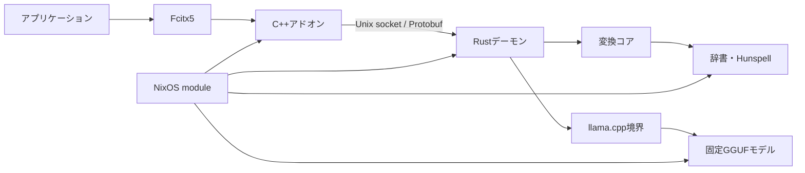

# アーキテクチャ

この文書は、現在のbeankeyを構成するコンポーネントと、その依存境界を説明します。初期実装の計画や完了条件ではなく、実装を変更するときに維持すべき構造を対象にします。

## 全体構成

Fcitx5プロセスへロードするのはC++アドオンだけです。辞書変換、学習、Zenzai推論は別プロセスのRustデーモンで実行し、変換やllama.cppの障害をFcitx5から分離します。

## コンポーネント

| 場所 | 責任 |
| --- | --- |
| `crates/converter` | 入力状態、辞書読み込み、ラティス探索、候補生成、学習、Zenzai用promptとprefix制約付き再探索 |
| `crates/llama` | llama.cpp C APIのbinding、モデル読み込み、tokenize、decode、logit取得 |
| `crates/daemon` | 設定、Unix socket、Protobuf、入力セッション、converterとllamaの接続 |
| `fcitx5` | Fcitx5 key eventの正規化、プリエディット、候補UI、確定、デーモン起動 |
| `proto/beankey.proto` | RustとC++の通信契約 |
| `nix` | package、固定資産、NixOS module、内部設定の生成 |
| `data` | 固定した辞書submodule |

## 依存境界

`crates/converter`は変換ロジックの所有者です。Fcitx5、Protobuf、ソケット、llama.cpp C API、NixOS設定には依存しません。

`crates/llama`はllama.cpp固有の型、pointer、`unsafe`処理を内部へ閉じ込めます。変換アルゴリズムとIPCは持ちません。

`crates/daemon`はconverterとllamaを組み合わせるアプリケーション境界です。辞書探索や候補順位付けを独自に実装しません。

Fcitx5アドオンは、Rust crateへ直接linkしません。候補の生成や並べ替えも行わず、デーモンの応答をFcitx5標準APIへ反映します。

## 入力処理

1. Fcitx5アドオンがkey eventを、入力、削除、移動、変換、確定などの意味的な操作へ変換します。
2. アドオンがFcitx5の入力コンテキストに対応するsession IDとともに、要求をデーモンへ送ります。
3. デーモンがsessionの入力状態を更新し、converterへ変換を要求します。
4. Zenzai評価が必要な場合は、デーモンがconverterのdraft候補とllamaの評価を接続します。
5. デーモンがプリエディット、候補、予測、確定文字列、キーを処理したかどうかを返します。
6. アドオンは応答をFcitx5の標準UIとcommit APIへ反映します。

同じsessionの要求は順番に処理します。異なるsessionの辞書処理は独立していますが、共有するllama.cpp contextへの推論は直列化します。

## Zenzai

Zenzaiは最終候補を一度だけ並べ替える処理ではありません。

1. converterが辞書ラティスからdraft候補を生成します。
2. 候補と周辺文脈からpromptを構築します。
3. llama.cppが候補tokenを評価します。
4. モデルが別のtokenを選んだ場合、その位置までのUTF-8 prefixを取得します。
5. converterがprefixを制約として辞書ラティスを再探索します。
6. 候補が通過するか、全文が確定するか、推論回数の上限に達するまで繰り返します。

converterはpromptと再探索、llama crateはモデル操作、デーモンは両者の進行を所有します。

## IPCとプロセス

アドオンとデーモンは、`$XDG_RUNTIME_DIR/beankey/daemon.sock`のUnix domain socket上で通信します。wire formatはvarint length-delimited Protobufで、1 messageの上限は1 MiBです。

各envelopeはprotocol version、request ID、session ID、payloadを持ちます。Fcitx5固有のkey symbolはwireへ流さず、意味的な操作だけを送ります。

アドオンがsocketへ接続できない場合は、Nix store pathへ固定された`beankey-daemon`を直接起動して再接続します。systemd serviceやsocket activationは使用しません。最後のclientが切断し、sessionがなくなるとデーモンも終了します。

runtime directoryはmode `0700`、socketはmode `0600`です。デーモンは接続peerのUIDを検証し、自分と異なるUIDからの接続を拒否します。stale socketはprocess lockを取得した同一UIDのデーモンだけが削除できます。

## 障害時の扱い

アドオンからデーモンへの要求には5秒の期限があります。接続、要求、応答に失敗した場合、アドオンは対応するsession、プリエディット、候補をresetします。

応答を得ていないキーはFcitx5でacceptせず、未処理としてアプリケーションへ返します。アドオン内でkey eventをbufferしたり、自動的に再送したりはしません。

## NixOS統合

公開設定は`programs.beankey`だけです。NixOS moduleは次のものを導入します。

- Fcitx5アドオン
- Rustデーモン
- 固定辞書と絵文字辞書
- 固定GGUFモデルとtokenizer
- nixpkgsのllama.cpp、Hunspell、英語・ギリシャ語辞書

moduleは`programs.beankey`から内部TOMLを生成し、`/etc/beankey/config.toml`からNix store上の生成物を参照させます。アドオンは、この設定ファイルを指定してデーモンを起動します。

モデル、辞書、tokenizer、実行ファイルはNix storeへ置きます。学習データなどの可変状態はユーザーのXDG state directoryに置き、Nix管理の不変資産と分離します。

## 配布資産

直接配布する辞書、絵文字データ、tokenizer、GGUFモデルには、資産ごとのlicense本文、取得元、固定revision、attributionをNix packageへ同梱します。

llama.cpp、Hunspell、Hunspell辞書はnixpkgsの通常依存として使用し、beankeyの配布資産として複製しません。製品のビルドと実行にSwiftは使用しません。
